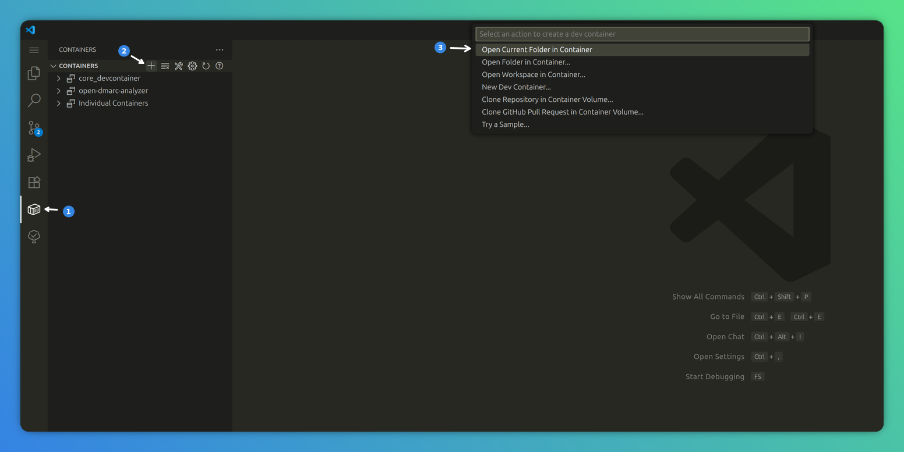

# InvoiceShelf Development Environment

This is dockerized development environment that allows developers to easily get started to develop InvoiceShelf.

This development environment is **NOT MEANT TO BE USED IN PRODUCTION** and is preconfigured with all the needed tools that InvoiceShelf requires for development purposes. It works on Windows, Linux and MacOS.

For production grade docker image, please refer to [InvoiceShelf/docker](https://github.com/InvoiceShelf/docker) and [InvoiceShelf on DockerHub](https://hub.docker.com/r/invoiceshelf/invoiceshelf).

## Table of Contents

- [InvoiceShelf Development Environment](#invoiceShelf-development-environment)
  - [How to set up](#how-to-set-up)
  - [Pre-requisites](#pre-requisites)
    - [Clone the project](#clone-the-project)
  - [Development Container Workflow](#development-container-workflow)
    - [(optional) `.devcontainer.json` adjustment](#optional-devcontainerjson-adjustment)
  - [Spinning Up](#spinning-up)
    - [Visual Studio Code](#visual-studio-code)
  - [Spinning Down](#spinning-down)
  - [Working with binaries](#working-with-binaries)
  - [What is included](#what-is-included)

## How to set up

In this section we will go through a couple of steps that you will need to complete on the host system and then mainly focus on the setup of your devcontainer.

## Pre-requisites

In order to develop using DevContainer you must have two things:

- [Docker](https://docs.docker.com/engine/install/) - where you development environment will be created; and
- [IDE supporting devcontainer](https://containers.dev/supporting) tested with VSCode (should also work with derivatives), also known to work with [PhpStorm](https://www.jetbrains.com/help/phpstorm/connect-to-devcontainer.html) and [IntelliJ](https://www.jetbrains.com/help/idea/connect-to-devcontainer.html)

### Clone the project

Clone the InvoiceShelf project directly from InvoiceShelf git or your forked repository:

```bash
git clone git@github.com:InvoiceShelf/InvoiceShelf.git
```

phew, ok, the difficult part is over 😅.

## Development Container Workflow

As part of the new workflow, you only need to have Docker installed on your host system. This greatly simplifies your environment setup and allows you to quickly spin up the project environment at will.

The way it works is as follows: we use your IDE's integrated or extended feature called "Dev Container." The Dev Container is a predefined environment that encapsulates all the dependencies, tools, and configurations required for your project. This means that you can work in a consistent environment, regardless of the underlying system on which your code is running.

When you open your project in the IDE, it _should_ automatically detects the Dev Container configuration and sets up the environment accordingly. This includes installing necessary packages, configuring settings, and ensuring that the correct versions of tools are available.

To start, simply run the blow command in the project root dir, then, re-open the project with the IDE or run `Developer: Reload Window` using Command Palette (in VSCode) so the `devcontainer.json` file can be detected:

```sh
cp .devcontainer/devcontainer.recommended.json .devcontainer/devcontainer.json
```

### (optional) `.devcontainer.json` adjustment

By default the SQLite container will be used for development, as it is by far the simplest to quickly spin up and tear down, if for one reason or another you wish to work with another DB you have predefined templates below, simply replace the

```json
      "dockerComposeFile": "docker-compose.sqlite.yml",
```

with the database flavour of your choice:

| Database          | Compose File                |
| ----------------- | --------------------------- |
| SQLite3 (default) | `docker-compose.sqlite.yml` |
| MariaDB           | `docker-compose.mysql.yml`  |
| PostgresSQL       | `docker-compose.pgsql.yml`  |

## Spinning Up

In different IDE's it's a bit different so below you will see a detailed explanation for each one:

### Visual Studio Code



## Spinning Down

Simply close the IDE and the container will eventually spin down, if not, you can always do so manually from within docker.

## Working with binaries

To correctly run `composer`, `npm`, `artisan`, `pint`, `pest` or other binaries within this project, you must ensure that your IDE is running inside the devcontainer.

Typically the IDE will indicate if that is the case e.g. VSCode will show this status indicator at the left of the status bar:


## What is included

### 1. Web Server

Dev container comes by default with useful goodies to make the development easier, such as Apache web server serving the site on port `:8080` simply spin up your devcontainer wait for it to complete installation and visit http://localhost:8080/ on your host system.

### 2. Databases

This dockerized environment comes with support for all three databases that InvoiceShelf suppots: MySQL, PostgreSQL and SQLite.

The setup parameters/credentials for each of the supported databases are as follows.

|             |    MySQL     |  PostgreSQL  |                   SQLite                    |
| ----------- | :----------: | :----------: | :-----------------------------------------: |
| **DB_USER** | invoiceshelf | invoiceshelf |                                             |
| **DB_PASS** | invoiceshelf | invoiceshelf |                                             |
| **DB_NAME** | invoiceshelf | invoiceshelf | /home/invoiceshelf/database/database.sqlite |
| **DB_HOST** |    mysql     |    pgsql     |                                             |
| **DB_PORT** |     3036     |     5432     |                                             |

**Note:** The only required field for SQLite is **DB_NAME**.

### 3. Adminer

Adminer is UI tool for viewing the database contents and executing queries.

It supports MySQL, PostgreSQL, SQLite.

**URL**: http://invoiceshelf.test:8080

#### MySQL/PostgresSQL

To log into the MySQL or PostgresSQL, use the database information specified in the above section (2. Databases)

#### SQLite

To log into the SQLite, use the following credentials:

| KEY          | VALUE                     |
| ------------ | ------------------------- |
| **USERNAME** | admin                     |
| **PASSWORD** | admin                     |
| **DATABASE** | /database/database.sqlite |

### 4. Mailpit (fake mail)

To utilize Mailpit, use the following credentials:

| KEY                 | VALUE       |
| ------------------- | ----------- |
| **MAIL DRIVER**     | smtp        |
| **MAIL HOST**       | mail        |
| **MAIL PORT**       | 1025        |
| **MAIL ENCRYPTION** | none        |
| **MAIL USER**       | leave empty |
| **MAIL PASS**       | leave empty |
| **FROM MAIL ADDR**  | your choice |
| **FROM MAIL NAME**  | your choice |

**URL**: http://invoiceshelf.test:8025

---

If you have any questions, feel free to open issue.
